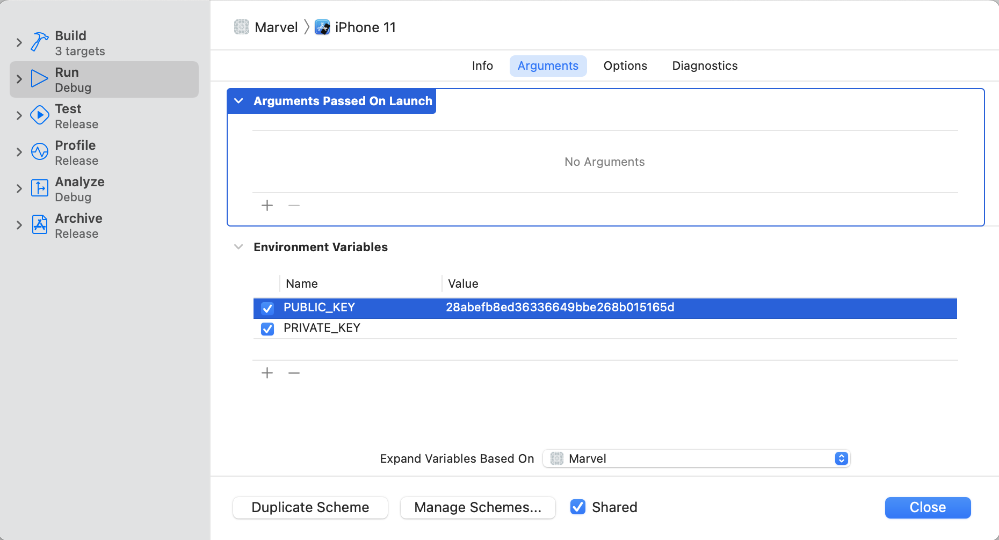

# Marvel
Marvel Characters iOS app

## About

This project developed by using swift language and MVVM pattern, it contains the list of Marvel characters and detailed desription
It has network layer, viewModel layer, model layer and view layer, and also it contains the unit testcase and also uitest Case
It contains third-party libraries, so do pod install and run the app

## Features

- **Characters list**: Display a list of marvel characters and images.
- **Character detail**: Display a image of a character and its short description.

  
  

To run the app, need to add the public and private API keys in scheme.
Steps -> Go to schemes in Marvel and select Edit Scheme and select the Run option now you able to see the private and public keys under Environment Variables.

  

